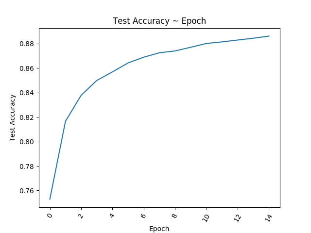
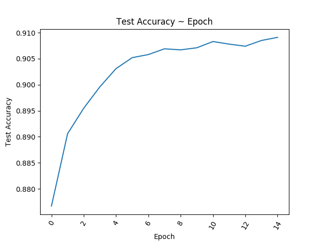

# Logistic Regression on MNIST with NumPy from Scratch
Implementing Logistic Regression on MNIST dataset from scratch

## Project Description

Implement and train a logistic regression model from scratch in Python on the MNIST dataset (no PyTorch). The logistic regression model should be trained on the Training Set using stochastic gradient descent. It should achieve 90-93% accuracy on the Test Set.

## Highlights

- **Logistic Regression**
- **SGD/SGD with momentum**
- **Learning Rate Decaying**

## Theoretical Derivation

### Model

Consider a logistic regression model for classification where $\mathcal{Y} = \{0,1,...,K-1\}$, weights $\theta\in\mathbb{R}^{K\times d}$ and biases $b\in \mathbb{R}^K$. Given an input $x \in \mathbb{R}^d$, the model $f(x;θ)$ produces a probability of each possible outcome in $\mathcal{Y} $ :
$$
f(x;θ,b)=F_{\text{softmax}}(\theta x+b),
\\F_{\text{softmax}}(z)=\frac{1}{\sum_{k=0}^{K-1}e^{z_k}}(e^{z_0},e^{z_1},...e^{z_{K-1}})
$$
where $z_k$ is the $k$-th element of the vector $z$. The set of probabilities on $\mathcal{Y}$ is $P(\mathcal{Y}) := \{p ∈ \mathbb{R}^K :􏰋\sum^{K−1}_{k=0} p_k =1,p_k \ge 0\ \forall\ k=0,...,K−1\}$ The function $F_{\text{softmax}}(z):\mathbb{R}^K\rightarrow \mathcal{P(Y)}$ is called the “softmax function” and is frequently used in deep learning. $F_{\text{softmax}}(z)$ takes a K-dimensional input and produces a probability distribution on $\mathcal{Y}$. That is, the output of $F_{\text{softmax}}(z)$ is a vector of probabilities for the events $0, 1, . . . , K − 1$. The softmax function can be thought of as a smooth approximation to the argmax function since it pushes its smallest inputs towards 0 and its largest input towards 1. 

### Objective Function

The objective function is the negative log-likelihood (commonly referred to in machine learning as the “cross-entropy error”): 
$$
\mathcal{L}(\theta,b)=\mathbb{E}_{(X,Y)}[\rho(f(X;\theta,b),Y)],
\\\rho(z,y)=-\sum_{k=0}^{K-1}\mathbf{1}_{y=k}\ \text{log}z_k,
\\\text{where }z_k \text{ is the k-th element of the vector }z\text{ and }\mathbf{1}_{y=k}\text{ is the indicator function}
\\

\mathbf{1}_{y=k}=\left\{ \begin{array}{ll}
1 & y=k\\
0 & y\ne k
\end{array} \right.
$$

### Mini-batch Gredian descent

$$
θ^{(l+1)} = θ^{(l)} −α^{(l)}\frac{1}{􏰌M}\sum_{m=1}^M 
∇_θ\rho(f(x^{(l,m)};θ^{(l)},b^{(l)}),y^{l,m}),
\\b^{(l+1)} = b^{(l)} −α^{(l)}\frac{1}{􏰌M}\sum_{m=1}^M 
∇_b\rho(f(x^{(l,m)};θ^{(l)},b^{(l)}),y^{l,m})
$$

### Derivation of SGD

We will derive the stochastic gradient descent algorithm for the logistic regression model. The logistic regression model $f(x;θ)$ is estimated from the dataset $(x_n, y_n)^N_{n=1}$ where $(x_n, y_n) ∼ \mathbb{P}_{X,Y}$ .

The gradient of the loss function for a generic data sample $(x, y)$ is
$$
∇_θρ(f (x;θ,b), y) = −∇_θ \text{log}F_{\text{softmax},y} (θx+b)
$$
where $F_{softmax,k}(z)$ is the k-th element of the vector output of the function $F_{softmax,k}(z)$. Let $θ_{k,:}$ be the k-th row of the matrix $θ$. 

If $k\ne y$, 
$$
\begin{eqnarray}
∇_{\theta_{k,:}}ρ(f (x;θ,b), y) & = & −∇_{\theta_{k,:}}\text{log}F_{\text{softmax},y} (θx+b)

\\ & = & -\frac{∇_{θ_{k,:}}F_{\text{softmax},y}(\theta x+b)}{F_{\text{softmax},y}(\theta x+b)}\\ & = & -\frac{1}{F_{\text{softmax},y}(\theta x+b)}\frac{0-e^{\theta_{y,:}x+b}\ e^{\theta_{k,:}x+b}}{(\sum_{m=0}^{K-1}e^{\theta_{m,:}x+b})^2}x

\\ & = & \frac{1}{F_{\text{softmax},y}(\theta x+b)}F_{\text{softmax},y}(\theta x+b)F_{\text{softmax},k}(\theta x+b)x\\ & = & F_{\text{softmax},k}(\theta x+b)x
\end{eqnarray}
$$
If $k=y$,
$$
\begin{eqnarray}
∇_{\theta_{k,:}}ρ(f (x;θ,b), y) & = & −∇_{\theta_{k,:}}\text{log}F_{\text{softmax},y} (θx+b)
\\ & = & -\frac{∇_{θ_{k,:}}F_{\text{softmax},y}(\theta x+b)}{F_{\text{softmax},y}(\theta x+b)}
\\ & = & -\frac{1}{F_{\text{softmax},y}(\theta x+b)}\frac{(\sum_{m=0}^{K-1}e^{\theta_{m,:}x+b})e^{\theta_{k,:}x+b}-e^{\theta_{y,:}x+b}\ e^{\theta_{k,:}x+b}}{(\sum_{m=0}^{K-1}e^{\theta_{m,:}x+b})^2}x
\\ & = & \frac{1}{F_{\text{softmax},y}(\theta x+b)}(1-F_{\text{softmax},k}(\theta x+b))F_{\text{softmax},y}(\theta x+b)x
\\ & = & F_{\text{softmax},k}(\theta x+b)x-x
\end{eqnarray}
$$


Hence, for any k,		
$$
∇_{\theta_{k,:}}ρ(f (x;θ,b), y) = -(\mathbf{1}_{y=k}-F_{\text{softmax},y}(\theta x+b))x
$$
Therefore,
$$
∇_{\theta}ρ(f (x;θ,b), y) = -(e(y)-F_{\text{softmax}}(\theta x+b))x^\top
$$
where,
$$
e(y)=(\mathbf{1}_{y=0},...,\mathbf{1}_{y=K-1})^\top.
$$
Similarly, we could get the gradient of the loss function with respect to $b$:
$$
∇_{b}ρ(f (x;θ,b), y) = -(e(y)-F_{\text{softmax}}(\theta x+b))
$$
The stochastic gradient descent algorithm is:

- Randomly initialize the parameter $\theta^{(0)}, b^{(0)}$.

- For $\mathcal{l}=0,1,...,L$ :

  - Select $M$ data samples $(x^{(l,m)}, y^{(l,m)})^M_{m=1}$ at random from the dataset $(x_n, y_n)^N_{n=1}$, where $M ≪ N$.
  - Calculate the gradient for the loss from the data sample:

  $$
  G_\theta^{(l)} = -\frac{1}{􏰌M}\sum_{m=1}^M (e(y^{(l,m)})-F_{\text{softmax}}(\theta^{(l)} x^{(l,m)}+b^{(l)}))(x^{(l,m)})^\top\\G_b^{(l)} = -\frac{1}{􏰌M}\sum_{m=1}^M (e(y^{(l,m)})-F_{\text{softmax}}(\theta^{(l)} x^{(l,m)}+b^{(l)}))
  $$

  - Update the parameters:

  $$
  \theta^{(l+1)}=\theta^{(l)}-\alpha^{(l)}G_\theta^{(l)},\\
  b^{(l+1)}=b^{(l)}-\alpha^{(l)}G_b^{(l)}
  $$

  ​	where $\alpha^{(l)}$ is the learning rate.

## Implementation

The model and main function is included in the script file `logistic_regression.py`. The outputs text are stored in `./logs/` as `.log` files, and the plots for the loss trend and accuracy trend are stored in `./assets/`. All the hyperparameters are stored in `./configs/` as `.json` files. Example: `config_sample.json`

```json
{
    "num_epoches" : 15,
    "batch_size" : 10,
    "learning_rate" : 0.0025,
    "learning_decay" : 0,
    "decay_factor" : 0.75,
    "momentum" : 0,
    "mu" : 0.9
}
```

Note that we implemented available options of **learning decay** and **SGD with momentum**.

In the code, I first loaded the MNIST data, and then set the random seed. After initializing the parameters, I trained the model using mini-batch stochastic gradient descent. If needed, **learning decay** (decay the learning rate by the decay factor when the test accuracy declines or increases by less than 0.1%) and **SGD with momentum**.

**SGD with Momentum:**

```python
if bool(hyp['momentum']) == True:
    w_velocity = mu * w_velocity + learning_rate * dw
    b_velocity = mu * b_velocity + learning_rate * db
    param['w'] -= w_velocity
    param['b'] -= b_velocity
```

**Learning Decay:**

```python
if bool(hyp['learning_decay']) == True:
    try:
        if test_accu_list[-1] - test_accu_list[-2] < 0.001:
            learning_rate *= hyp['decay_factor']
    except:
        pass
```

For each epoch, we evaluate the loss and accuracy.

## Training Results

The training results of 4 configurations are shown as follows. 


|                       |             config_sample              |             config_1              | config_2                          | config_3                          |
| :-------------------: | :------------------------------------: | :-------------------------------: | --------------------------------- | --------------------------------- |
|       Optimizer       |                  SGD                   |                SGD                | SGD                               | SGD                               |
|   Number of Epoches   |                   15                   |                15                 | 15                                | 15                                |
|      Batch Size       |                   10                   |              **100**              | **100**                           | 10                                |
|     Learning Rate     |                 0.005                  |            **0.0025**             | **0.0025**                        | 0.005                             |
|    Learning Decay     |                  ----                  |               ----                | ----                              | **0.75**                          |
|   Momentum ($\mu$)    |                  ----                  |               ----                | **0.9**                           | ----                              |
|   Optimal Test Loss   |           3310.17 @ Epoch 6            |        4618.44 @ Epoch 15         | 3296.48 @ Epoch 15                | 3310.17 @ Epoch 6                 |
| Optimal Test Accuracy |            0.9093 @ Epoch 6            |         0.8861 @ Epoch 15         | 0.9091 @ Epoch 15                 | 0.9093 @ Epoch 6                  |
|      Loss Trend       |  |  |  |  |
|    Accuracy Trend     |  |  |  |  |

Comments: 

- **Config_sample:** The accuracy drops after epoch 6 . 
- **Config_1:** By increasing the batch size and decreasing the learning rate, the convergence rate decreases because of fewer descent iterations.
- **Config_2:** Adding momentum allows the model to converge faster.
- **Config_3:** Allowing learning decay prevents the accuracy from droping dramatically.